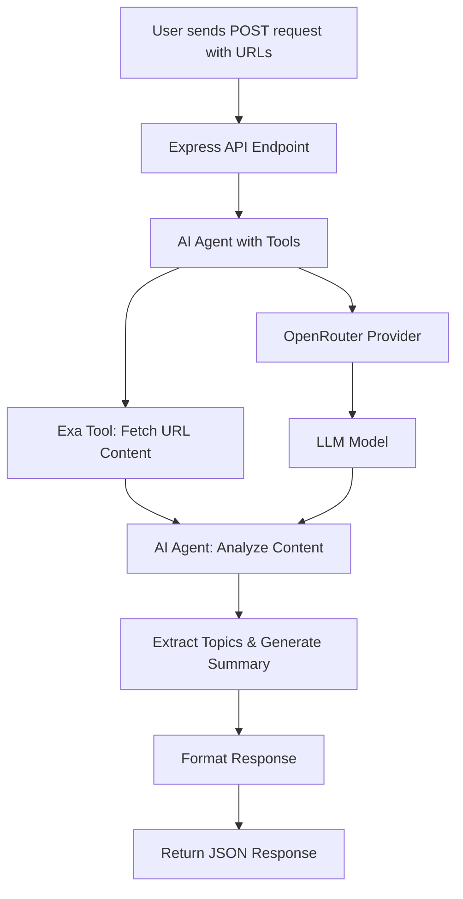

# News Aggregator AI Agent Imple

mentation Plan

## Overview

Create a news aggregator that uses AI SDK's ToolLoopAgent to process news URLs, extract content via Exa, and generate structured output with summaries, related topics, and citations using OpenRouter as the provider.

## Architecture Flow




## Implementation Steps

### 1. Project Setup

- Initialize Node.js project with `package.json`
- Install dependencies:
- `ai` (AI SDK core)
- `@exalabs/ai-sdk` (Exa tool)
- `@openrouter/ai-sdk-provider` (OpenRouter provider)
- `express` (API server)
- `zod` (schema validation)
- `dotenv` (environment variables)
- TypeScript and type definitions

### 2. Environment Configuration

- Create `.env` file template with:
- `EXA_API_KEY`
- `OPENROUTER_API_KEY`
- `PORT` (optional, default 3000)

### 3. Core Agent Implementation

Create `src/agent/newsAgent.ts`:

- Initialize OpenRouter provider
- Configure Exa web search tool
- Create ToolLoopAgent with:
- Model: OpenRouter chat model (e.g., `anthropic/claude-3.5-sonnet`)
- Tools: Exa web search/extraction
- Stop condition: `stepCountIs(10)` (configurable)
- Agent prompt: Instruct to extract topics, generate summary, and identify citations

### 4. URL Processing Service

Create `src/services/urlProcessor.ts`:

- Accept array of URLs from input
- For each URL:
- Use Exa tool to fetch and extract content
- Pass to AI agent for analysis
- Aggregate results into cluster format

### 5. Response Formatter

Create `src/utils/formatter.ts`:

- Transform agent output to match required schema:
  ```typescript
                  {
                    clusterId: string,
                    title: string,
                    summary: string,
                    articleCount: number,
                    latestDate: string,
                    sources: Array<{
                      source: string,
                      title: string,
                      url: string,
                      pubDate: string
                    }>
                  }
  ```


- Extract topics from agent response
- Format dates consistently
- Generate clusterId

### 6. Express API Endpoint

Create `src/routes/news.ts`:

- POST `/api/news/process`
- Request body: 
  ```typescript
                  {
                    urls: string[],
                    clusterId?: string  // optional, for updating existing cluster
                  }
  ```


- Response: Cluster object with summary, topics, citations
- Error handling middleware

### 7. Main Server File

Create `src/server.ts`:

- Initialize Express app
- Configure middleware (JSON parsing, CORS if needed)
- Mount routes
- Start server on configured port

### 8. Type Definitions

Create `src/types/index.ts`:

- Define interfaces for:
- Cluster input/output
- Source object
- API request/response types

## Key Files Structure

```javascript
news-agg/
├── src/
│   ├── agent/
│   │   └── newsAgent.ts          # AI Agent configuration
│   ├── services/
│   │   └── urlProcessor.ts       # URL processing logic
│   ├── routes/
│   │   └── news.ts                # Express API routes
│   ├── utils/
│   │   └── formatter.ts           # Response formatting
│   ├── types/
│   │   └── index.ts               # TypeScript types
│   └── server.ts                  # Express server entry point
├── .env.example                   # Environment variables template
├── package.json
├── tsconfig.json
└── README.md
```


## Agent Tool Configuration

The agent will use Exa tool with:

- `webSearch`: For finding related articles (if needed)
- `extractContent`: For extracting content from provided URLs
- Custom prompt to instruct agent to:

1. Extract main topics from articles
2. Generate comprehensive summary
3. Identify and format citations
4. Determine article relationships

## Error Handling

- Validate URLs before processing